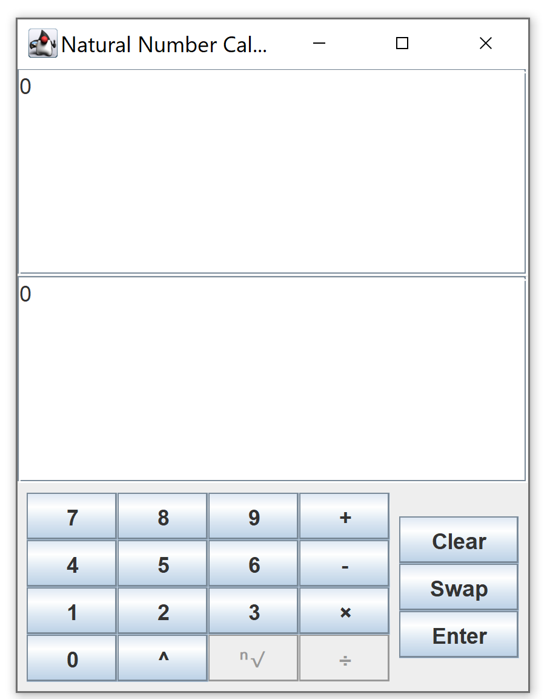
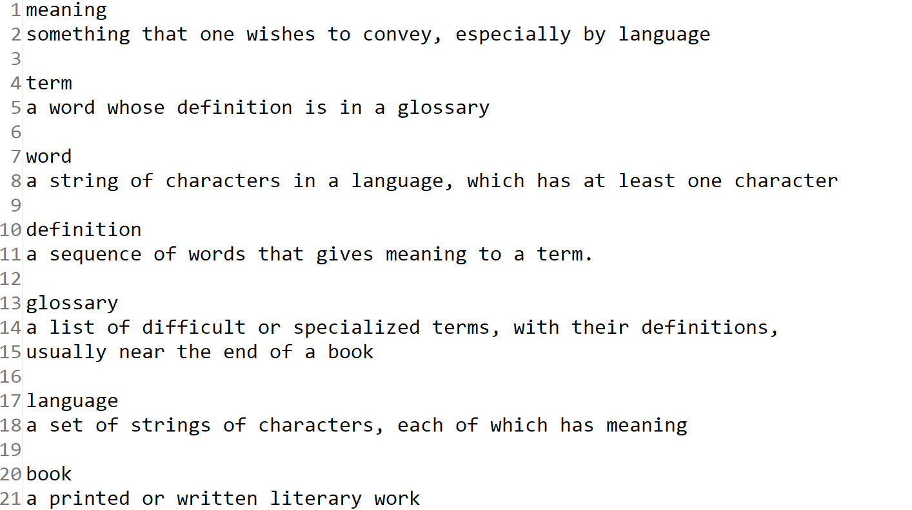
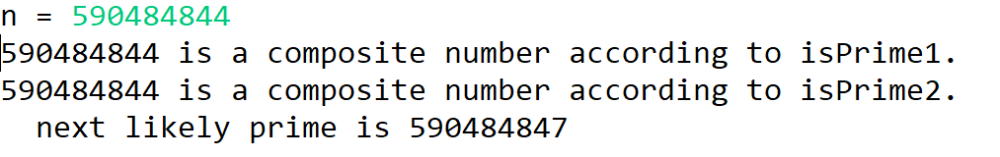
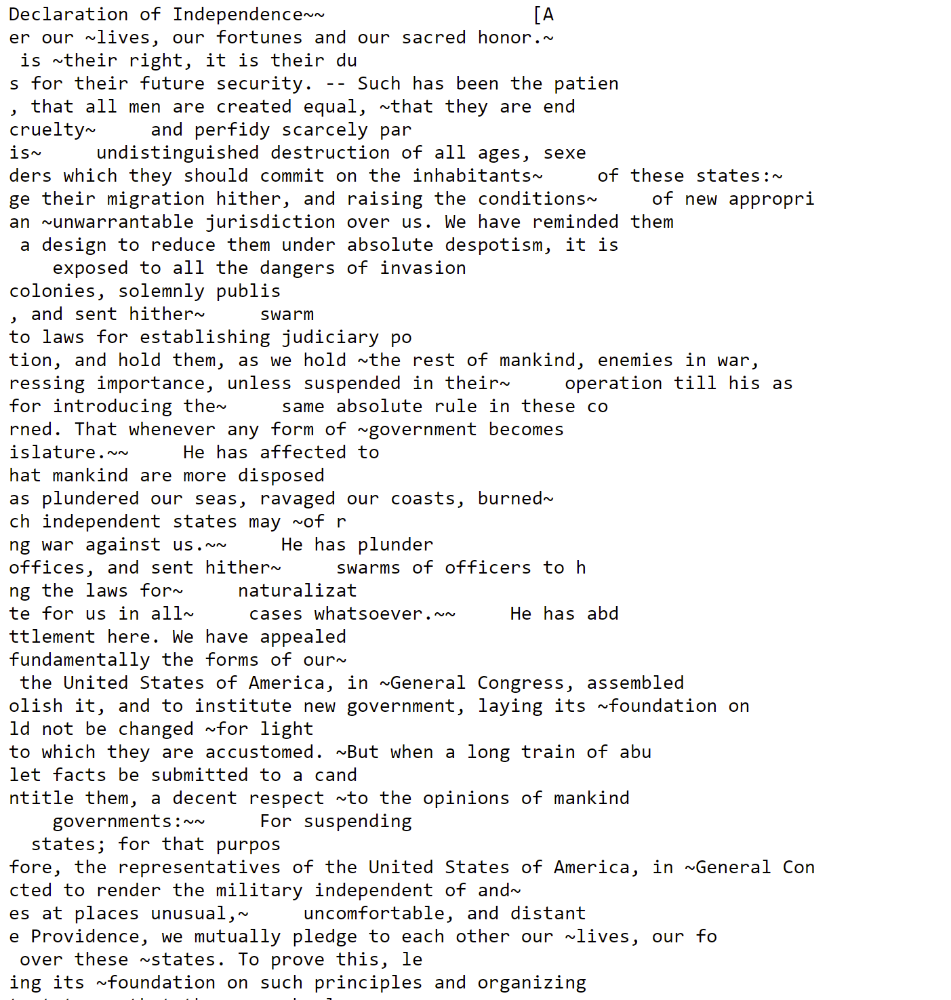
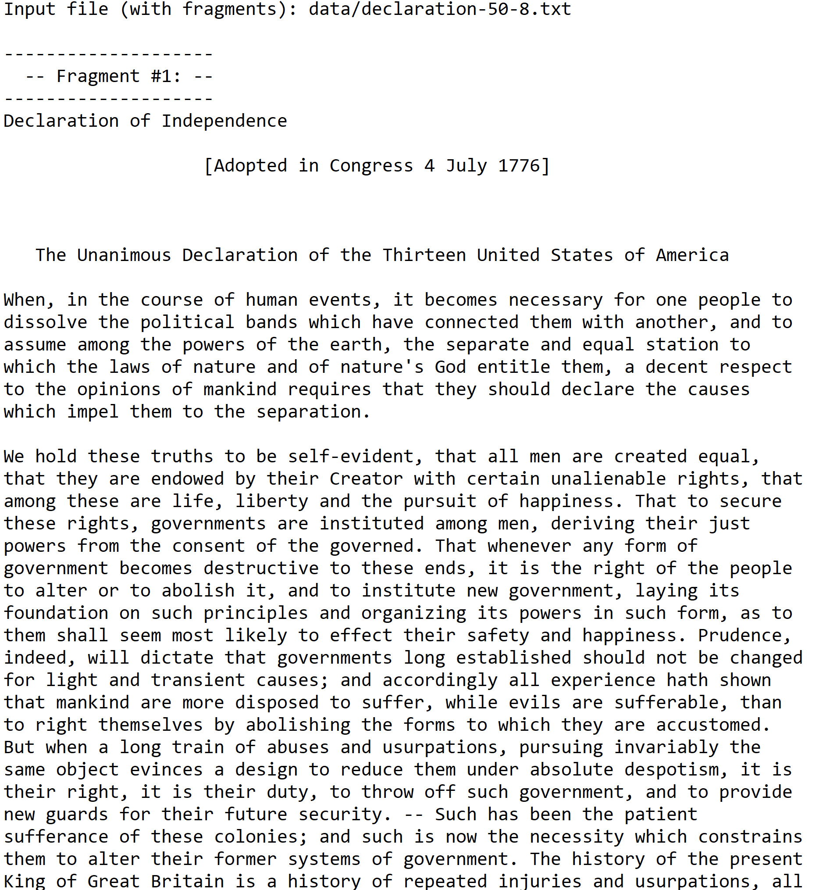

# **Portfolio**

**This page contains brief descriptions and code snippits of past projects. Click on the project for the full code and a more in-depth explanation!**
  

## **1.** [Natural Number Calculator](https://github.com/julian-irizarry/programming/tree/main/NaturalNumberCalculator)

Created a functional Natural Number calculator graphical user interface (GUI) using the Swing framework and components designed following the model-view-controller (MVC) design pattern.

<small><i>Calculator GUI</i></small>

  

## **2.** [Glossary](https://github.com/julian-irizarry/programming/tree/main/glossary)

Given a .txt file structured as a term on one line, the definition on the next, and then a blank line separating the next term, a sorted html glossary with clickable links to the definitions is created. The glossary was implemented using a (key,value) data structure. 

<small><i>Example of .txt file.</i></small>

Example output: [Glossary](assets/html/index.html)
  

## **3.** [CryptographicUtilities](https://github.com/julian-irizarry/programming/tree/main/CryptoUtilities)

Determines whether or not a very large number is prime using Fermat's little theorem:
* If n is prime and 1 < w < n – 1, then w2 mod n ≠ 1.
* If n is prime and 0 < w < n, then wn – 1 mod n = 1.
* If n is composite (i.e., not prime) and 1 < w < n, then it is "likely" that wn – 1 mod n ≠ 1.

JUnit testing used to test the bounds in the program and any oddities.

<small><i>Example of Output</i></small>

  

## **4.** [String Reassembly From Fragments](https://github.com/julian-irizarry/programming/tree/main/reassembly)

A .txt file that is fragmented is reassembled through overlapping prefixes and suffixes. The strings with the most overlap are combined and the process is continued until there are no suffixes and prefixes that are overlapping.

<small><i>Example of Input .txt file (click image for .txt file).</i></small>

<small><i>Example Output (click image for .txt file).</i></small>

  
